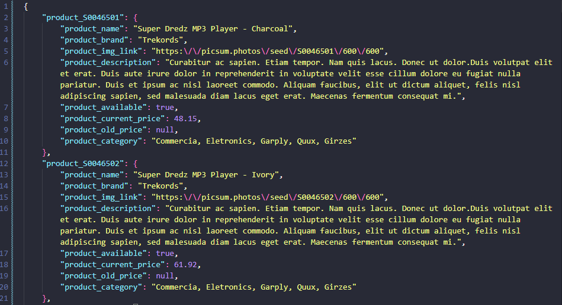
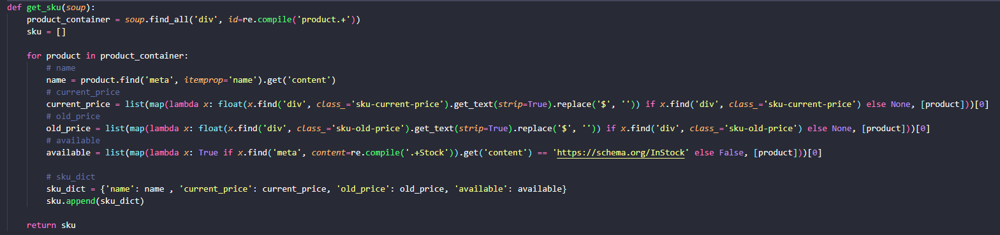

<h1 align='center'> Webscrap do site mostrado na entrevista </h1>

<h2> Formato de saída: </h2>

Como eu estou resolvendo fazer esse scrap sem um formato de saída definido, eu fiz assim: O formato de saída ficou um json com vários json dentro, sendo cada um identificado pelo seu product_id

---

<h2>Resolução completa do que foi pedido na entrevista para mudar a saída do SKU para um array de objetos:</h2> 

